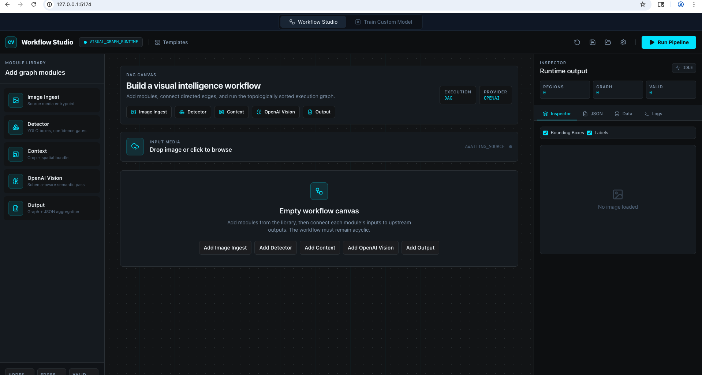
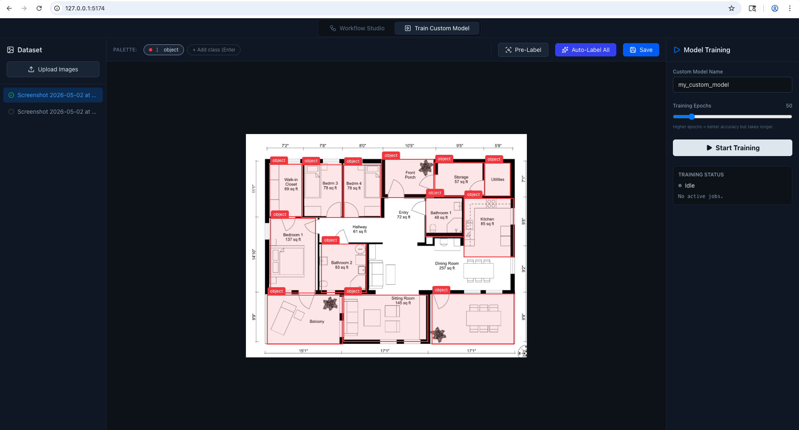
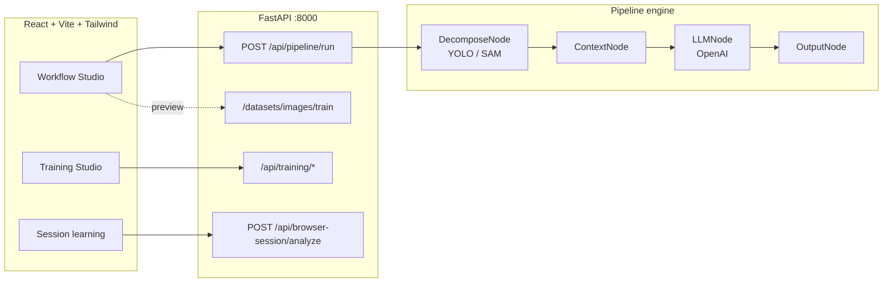

<div align="center">


[](https://www.python.org/)
[](https://fastapi.tiangolo.com/)
[](https://react.dev/)
[](https://vitejs.dev/)
[](https://tailwindcss.com/)

**Compose CV pipelines with YOLO (or SAM), enrich regions with OpenAI vision, and train custom detectors—all from one studio.**

[Motivation](#motivation) · [Use cases](#use-cases) · [Features](#features) · [Quick start](#quick-start) · [Architecture](#architecture) · [API](#api-cheatsheet)

</div>

> **Branch focus — [`feat/browser-session-recording-learning`](https://github.com/harshadindigal-dev/vision-workbench/tree/feat/browser-session-recording-learning):** capture **browser screen recordings**, infer **what was clicked** (and when), and turn demos into **structured action traces** that plug into composable CV + VLM pipelines. **[Design doc →](docs/browser-session-recording-learning.md)**

---

## Preview

<table>
  <tr>
    <td align="center" width="50%">
      <b>Workflow Studio</b><br/>
      <sub>Linear builder · run · JSON graph</sub><br/><br/>
      <a href="docs/screenshots/workflow.png"></a>
    </td>
    <td align="center" width="50%">
      <b>Train Custom Model</b><br/>
      <sub>Dataset · boxes · YOLO training</sub><br/><br/>
      <a href="docs/screenshots/training.png"></a>
    </td>
  </tr>
</table>

<details>
<summary><b>Vector previews</b> (no install needed)</summary>

Concept art still lives at [`docs/preview-workflow-studio.svg`](docs/preview-workflow-studio.svg) and [`docs/preview-training-studio.svg`](docs/preview-training-studio.svg) if you prefer SVG placeholders for forks or docs builds.

</details>

---

<a id="motivation"></a>

## 🔥 Part 1: Motivation

Modern computer vision and vision-language models are powerful, but they consistently fail at tasks that require **structured reasoning over complex visual inputs**.

Typical pipelines treat vision as a one-shot problem:

> Image → Model → Output

This approach breaks down when tasks require:

- Spatial reasoning (relationships between objects or regions)
- Multi-step understanding (analyzing parts individually, then combining)
- Consistent, structured outputs (JSON, graphs, coordinates)
- Interaction with complex interfaces (UIs, documents, layouts)

The core issue is that **visual intelligence is inherently compositional**, but most systems are not.

---

### 💡 Key Insight

Better results come from:

- Decomposing images into meaningful regions
- Extracting intermediate representations (masks, bounding boxes, text)
- Encoding spatial and semantic relationships explicitly
- Applying reasoning on top of structured data—not raw pixels

---

### 🚀 What This Repo Does

This project introduces **Composable Vision Workflows for Structured Perception and Reasoning**.

Instead of relying on a single model, it enables:

1. Modular CV steps (segmentation, detection, OCR, etc.)
2. Region-aware processing (per object / per segment)
3. Explicit spatial context encoding
4. Integration with vision-language models for reasoning
5. Structured outputs (JSON, graphs, coordinates)

---

### 🎯 Why It Matters

This approach makes visual systems:

- More accurate on complex tasks
- Interpretable (you see every step)
- Controllable (you define how the model sees)
- Debuggable (inspect intermediate outputs)

This is not just a CV pipeline tool.

👉 It is a **development environment for building visual reasoning systems**.

---

<a id="use-cases"></a>

## 🚀 Part 2: Use Cases & Example Workflows

### 🏠 1. Floor Plan / Blueprint Understanding

**Goal:** Convert architectural images into structured layouts

**Workflow:**

- Segment rooms
- Extract each room (crop + mask)
- Detect doors and windows per room
- Build spatial adjacency relationships
- Classify room types using VLM
- Merge into a structured layout

**Output:**

- JSON with rooms, connections, coordinates

**Use Cases:**

- Real estate automation
- Indoor navigation
- Architectural analysis

---

### 📄 2. Document Layout Parsing

**Goal:** Turn complex documents into structured data

**Workflow:**

- Segment layout regions (headers, tables, paragraphs)
- Run OCR per region
- Classify section types
- Reconstruct document hierarchy

**Output:**

- Structured JSON (sections, tables, text blocks)

**Use Cases:**

- Document intelligence
- Data extraction from PDFs
- Form processing

---

### 🌐 3. UI/UX Agent Builder (Browser Navigation)

**Goal:** Enable agents to reliably navigate and interact with user interfaces

**Workflow:**

- Detect UI elements (buttons, inputs, links)
- Segment layout (nav bar, content, modals)
- Extract text labels (OCR)
- Build structured UI representation
- Use VLM to decide next action
- Convert into executable commands (click, type, scroll)

**Output:**

- Structured action plans with coordinates and targets

**Use Cases:**

- Autonomous web agents
- RPA (robotic process automation)
- QA and UI testing
- AI copilots for software navigation

---

### 🛍️ 4. Retail Shelf Analysis

**Goal:** Understand product layouts and inventory

**Workflow:**

- Detect products
- Segment shelf regions
- Classify items
- Count and organize inventory

**Use Cases:**

- Stock monitoring
- Retail analytics
- Planogram compliance

---

### 🚗 5. Scene Understanding (Robotics / Autonomous Systems)

**Goal:** Build structured representations of real-world environments

**Workflow:**

- Segment scene elements
- Detect objects
- Estimate spatial relationships
- Construct scene graph

**Use Cases:**

- Robotics navigation
- Autonomous driving
- Environment mapping

---

### 🧬 6. Medical Imaging (Advanced)

**Goal:** Extract structured insights from scans

**Workflow:**

- Segment regions of interest
- Classify anomalies
- Track changes over time

**Use Cases:**

- Diagnostics support
- Longitudinal analysis

---

## ⚡ Summary

This system is designed for problems that involve:

- Multiple objects or regions
- Spatial relationships
- Multi-step reasoning
- Structured outputs

It enables workflows that are not possible with single-model approaches.

👉 Instead of asking a model to “figure everything out,”  
you **guide the perception process step-by-step and make reasoning explicit**.

---

## Features

| Area | What you get |
|------|----------------|
| **Workflow Studio** | Drag-and-connect steps: ingest → detector (YOLO/SAM) → context bundle → OpenAI vision (optional JSON schema) → graph output. |
| **Vision + LLM** | Regions get crops + spatial metadata; the VLM runs per region with optional strict-ish JSON schema validation. |
| **Training Studio** | Upload images, annotate boxes, pre-annotate / auto-annotate helpers, class management, YOLO training via Ultralytics. |
| **Session learning** | Upload a browser screen recording: sampled timeline + YOLO boxes per frame, ranked **interaction hints** via frame differencing, optional **VLM** hypotheses; optional **`pointer_events_json`** merges **extension-logged `pointerdown` + rects** into **`ground_truth_pointer_events`**. Chrome MV3 helper: **`extensions/pointer-logger`**. |
| **API** | FastAPI backend with CORS for local dev; static serving for dataset training images. |

### Session learning — supervision stack

- **Without pointer JSON:** hints stay **visual change** + generic **COCO** weights + optional **VLM** — useful but **not** literal click labels.
- **With pointer JSON:** install **`extensions/pointer-logger`** (Chrome → Load unpacked) → **Align clock** → start screen capture immediately → interact → **Export JSON** → attach next to the video in Session learning. The API aligns **`pointerdown`** coordinates and **`getBoundingClientRect`** against sampled frames (viewport scaled to frame size) and returns **`ground_truth_pointer_events`** with detector hits / IoU cues.
- **UI-specialized detector:** train in **Training Studio** and pass **`detector_model`** (paths under `backend/` are resolved automatically).

---

## Architecture

GitHub renders Mermaid—zoom the diagram on github.com for detail.



<details>
<summary><b>Repository layout</b></summary>

```
cv-llm-pipeline/
├── backend/
│   ├── main.py              # App entry, pipeline endpoint, static mounts
│   ├── routers/training.py   # Dataset + training APIs
│   └── engine/               # Pipeline + nodes (decompose, context, llm, output)
├── frontend/
│   └── src/                  # App shell, Workflow + Training UIs
├── docs/
│   ├── readme-banner.svg
│   ├── preview-workflow-studio.svg
│   └── preview-training-studio.svg
└── README.md
```

</details>

---

## Quick start

### Prerequisites

- **Python 3.9+** with `pip`
- **Node.js** (for Vite; LTS recommended)
- **OpenAI API key** as `OPENAI_KEY` for LLM steps ([platform.openai.com](https://platform.openai.com/))
- Ultralytics will fetch YOLO weights on first use (network access)

### Backend

From the **repository root**:

```bash
cd backend
python -m venv venv
source venv/bin/activate   # Windows: venv\Scripts\activate
pip install fastapi uvicorn python-multipart ultralytics opencv-python-headless pillow pydantic python-dotenv openai pyyaml
python main.py
```

The API listens on **`http://localhost:8000`**.

### Frontend

```bash
cd frontend
npm install
npm run dev
```

Open the URL Vite prints (typically **`http://localhost:5173`**). The UI is wired to **`http://localhost:8000`** for API calls.

<details>
<summary><b>Environment variables</b></summary>

Create a `.env` file at the **project root** and/or under `backend/` (the code loads both):

| Variable | Used for |
|----------|-----------|
| `OPENAI_KEY` | Required when running **LLM / vision** nodes (`LLMNode`), and when **Session learning** uses **Explain transitions with VLM**. |

Training flows may use additional keys depending on your `routers/training.py` setup—check that file for `load_dotenv` and client initialization.

</details>

---

## API cheatsheet

| Method | Path | Purpose |
|--------|------|---------|
| `POST` | `/api/pipeline/run` | Multipart: image + `pipeline_config` JSON → regions + graph |
| — | `/api/training/*` | Dataset upload, annotations, training job control |
| `POST` | `/api/browser-session/analyze` | Multipart: video + sampling options → timeline, interaction hints, optional VLM hypotheses (`use_vlm`, `max_vlm_hints`), optional **`pointer_events_json`** (array or `{events:[]}`) for supervision merge |
| `DELETE` | `/api/browser-session/session/{id}` | Remove cached thumbnails for a session |
| `GET` | `/datasets/images/train/...` | Training image assets (static) |

Interactive docs: **`http://localhost:8000/docs`** (Swagger UI).

---

## Stack

**Backend:** FastAPI · Ultralytics (YOLO/SAM) · OpenAI Python SDK · Pillow · OpenCV  
**Frontend:** React 19 · TypeScript · Vite 8 · Tailwind CSS 4 · Lucide icons · Axios

---

<div align="center">

<sub>Built for experimenting with vision pipelines and small custom detectors without jumping between five different tools.</sub>

</div>
