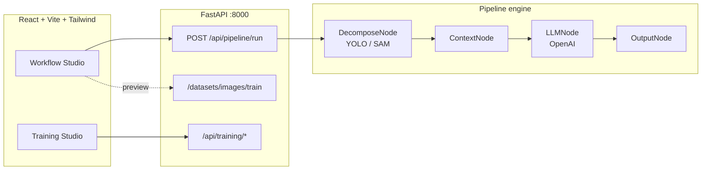

<div align="center">


[](https://www.python.org/)
[](https://fastapi.tiangolo.com/)
[](https://react.dev/)
[](https://vitejs.dev/)
[](https://tailwindcss.com/)

**Compose CV pipelines with YOLO (or SAM), enrich regions with OpenAI vision, and train custom detectors—all from one studio.**

[Features](#-features) · [Quick start](#-quick-start) · [Architecture](#-architecture) · [API](#-api-cheatsheet)

</div>

---

## Preview

<table>
  <tr>
    <td align="center" width="50%">
      <b>Workflow Studio</b><br/>
      <sub>Linear builder · run · JSON graph</sub><br/><br/>
      <a href="docs/screenshots/workflow.png"></a>
    </td>
    <td align="center" width="50%">
      <b>Train Custom Model</b><br/>
      <sub>Dataset · boxes · YOLO training</sub><br/><br/>
      <a href="docs/screenshots/training.png"></a>
    </td>
  </tr>
</table>

<details>
<summary><b>Vector previews</b> (no install needed)</summary>

Concept art still lives at [`docs/preview-workflow-studio.svg`](docs/preview-workflow-studio.svg) and [`docs/preview-training-studio.svg`](docs/preview-training-studio.svg) if you prefer SVG placeholders for forks or docs builds.

</details>

---

## Features

| Area | What you get |
|------|----------------|
| **Workflow Studio** | Drag-and-connect steps: ingest → detector (YOLO/SAM) → context bundle → OpenAI vision (optional JSON schema) → graph output. |
| **Vision + LLM** | Regions get crops + spatial metadata; the VLM runs per region with optional strict-ish JSON schema validation. |
| **Training Studio** | Upload images, annotate boxes, pre-annotate / auto-annotate helpers, class management, YOLO training via Ultralytics. |
| **API** | FastAPI backend with CORS for local dev; static serving for dataset training images. |

---

## Architecture

GitHub renders Mermaid—zoom the diagram on github.com for detail.



<details>
<summary><b>Repository layout</b></summary>

```
cv-llm-pipeline/
├── backend/
│   ├── main.py              # App entry, pipeline endpoint, static mounts
│   ├── routers/training.py   # Dataset + training APIs
│   └── engine/               # Pipeline + nodes (decompose, context, llm, output)
├── frontend/
│   └── src/                  # App shell, Workflow + Training UIs
├── docs/
│   ├── readme-banner.svg
│   ├── preview-workflow-studio.svg
│   └── preview-training-studio.svg
└── README.md
```

</details>

---

## Quick start

### Prerequisites

- **Python 3.9+** with `pip`
- **Node.js** (for Vite; LTS recommended)
- **OpenAI API key** as `OPENAI_KEY` for LLM steps ([platform.openai.com](https://platform.openai.com/))
- Ultralytics will fetch YOLO weights on first use (network access)

### Backend

From the **repository root**:

```bash
cd backend
python -m venv venv
source venv/bin/activate   # Windows: venv\Scripts\activate
pip install fastapi uvicorn python-multipart ultralytics opencv-python-headless pillow pydantic python-dotenv openai pyyaml
python main.py
```

The API listens on **`http://localhost:8000`**.

### Frontend

```bash
cd frontend
npm install
npm run dev
```

Open the URL Vite prints (typically **`http://localhost:5173`**). The UI is wired to **`http://localhost:8000`** for API calls.

<details>
<summary><b>Environment variables</b></summary>

Create a `.env` file at the **project root** and/or under `backend/` (the code loads both):

| Variable | Used for |
|----------|-----------|
| `OPENAI_KEY` | Required when running **LLM / vision** nodes (`LLMNode`). |

Training flows may use additional keys depending on your `routers/training.py` setup—check that file for `load_dotenv` and client initialization.

</details>

---

## API cheatsheet

| Method | Path | Purpose |
|--------|------|---------|
| `POST` | `/api/pipeline/run` | Multipart: image + `pipeline_config` JSON → regions + graph |
| — | `/api/training/*` | Dataset upload, annotations, training job control |
| `GET` | `/datasets/images/train/...` | Training image assets (static) |

Interactive docs: **`http://localhost:8000/docs`** (Swagger UI).

---

## Stack

**Backend:** FastAPI · Ultralytics (YOLO/SAM) · OpenAI Python SDK · Pillow · OpenCV  
**Frontend:** React 19 · TypeScript · Vite 8 · Tailwind CSS 4 · Lucide icons · Axios

---

<div align="center">

<sub>Built for experimenting with vision pipelines and small custom detectors without jumping between five different tools.</sub>

</div>
